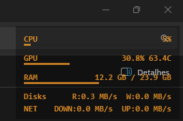
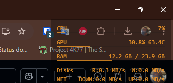

# HalfLife Monitoring Theme for Rainmeter

<p align="center">
  
</p>
<p align="center">
  
  
</p>

Need the Portuguese version? Read the [README em português](docs/README.pt-BR.md).

Minimal hardware monitoring Half-Life style overlay theme for [Rainmeter](https://www.rainmeter.net/) to watch CPU, GPU, and more.

  <a href="#features">Features</a>
  <a href="#installation">Installation</a>
  <a href="#usage">Usage</a>
</p>

---

## Features

- **CPU**: Usage %
- **GPU**: Usage % + Temperature °C *(NVIDIA/AMD/Intel)*
- **RAM**: Usage in GB
- **Disk**: Read/Write activity in MB/s
- **Network**: Download/Upload in MB/s

> **Note**: FPS monitoring is not included as it requires hooking into game rendering engines (DirectX/Vulkan), which needs external tools like MSI Afterburner/RivaTuner. For FPS overlay, use those tools alongside this skin.

*About TempBridge:* TempBridge is a tiny .NET helper (~50 MB RAM at peak) that bridges LibreHardwareMonitor sensors to Rainmeter. Rainmeter cannot read GPU temperature/usage natively, so TempBridge runs in the background, writes a lightweight `hwstats.txt`, and stays invisible by starting as a Windows service.

### Key Benefits

- **Real GPU monitoring** - Uses LibreHardwareMonitorLib for accurate readings
- **Lightweight** - Minimal resource usage (~10MB RAM)
- **Customizable** - Edit colors, position, and metrics easily
- **Auto-start** - Runs on Windows startup
- **Open Source** - MIT License

---

## Requirements

- **Windows 10/11** (x64)
- **Rainmeter 4.5+** - [Download](https://www.rainmeter.net/)
- **.NET 8.0 Runtime** - [Download](https://dotnet.microsoft.com/download/dotnet/8.0)

---

## Installation

### Quick Install (Recommended)

1. **Download** the latest `.rmskin` file *and* the `TempBridge.exe` + `install.bat` assets from the [Releases Page](https://github.com/kaic/halflife-monitoring/releases) (place the `.exe` and `.bat` in the same folder).
2. **Double-click** the `.rmskin` to install the Rainmeter skin.
3. **Open** an elevated Command Prompt, navigate to the TempBridge folder, and run `install.bat` (this installs the helper as a hidden Windows service so Rainmeter can read GPU sensors).
4. **Done!** The overlay will appear in the top-right corner and TempBridge will auto-start at boot.

### Manual Install

<details>
<summary>Click to expand manual installation steps</summary>

#### 1. Install Rainmeter Skin

- Double-click `HalfLifeMonitoring.rmskin`
- Follow the Rainmeter installer prompts

#### 2. Install TempBridge (hidden service)

- Copy `TempBridge.exe` and `install.bat` from the release assets to the same folder
- Open **Command Prompt as Administrator**
- Run `install.bat`
- The installer copies TempBridge to `%ProgramData%\TempBridge`, registers a LocalSystem service (auto-start), and launches it hidden automatically so Rainmeter always has fresh sensor data
- During install we automatically run `Unblock-File` so SmartScreen should not prompt; if your AV flags it, allow it once
- Use `TempBridge\uninstall.bat` (Admin) if you want to remove the auto-start entry later

#### 3. Load the Skin

- Open Rainmeter
- Find "HalfLifeMonitoring" in the skin list
- Click "Load"

</details>

---

## Usage

### First Run

After installation, you should see:

- TempBridge running (console window or tray icon)
- Rainmeter overlay in the top-right corner
- All metrics updating in real-time

### Customization

Edit `HalfLifeMonitoring.ini` to customize:

```ini
[Variables]
; Change colors (R,G,B,Alpha)
textColor=0,255,255,190
barColor=0,255,255,160

; Change position
WindowX=(#SCREENAREAWIDTH# - #width# - 20)
WindowY=40
```

### Troubleshooting

**GPU shows 0%?**

- Ensure TempBridge is running
- Check that `@Resources/hwstats.txt` exists and is being updated
- Try restarting TempBridge

**Disk always 0 MB/s?**

- Open Command Prompt as Administrator
- Run: `lodctr /r`
- Restart your computer

**Skin not loading?**

- Refresh Rainmeter (right-click → Refresh All)
- Check Rainmeter logs for errors

---

## Building from Source

### Prerequisites

- .NET 8.0 SDK
- Visual Studio 2022 or VS Code (optional)

### Build Steps

```bash
# Clone the repository
git clone https://github.com/yourusername/halflife-monitoring.git
cd halflife-monitoring

# Build TempBridge
cd TempBridge
dotnet restore
dotnet publish -c Release -r win-x64 --self-contained true -p:PublishSingleFile=true -o ../dist/TempBridge
```

Output will be in `dist/` folder.

---

## Project Structure

```
halflife-monitoring/
├── TempBridge/              # C# background service
│   ├── Program.cs           # Main sensor reading logic
│   ├── TempBridge.csproj    # Project file
│   └── install.bat          # Startup installer
├── HalfLifeMonitoring.ini   # Rainmeter skin
├── @Resources/              # Skin resources
│   └── hwstats.txt          # Sensor data (generated)
├── scripts/                 # Build automation
│   └── build-release.bat
├── installer/               # Distribution
│   └── setup.bat
└── README.md
```

---

## Contributing

Contributions are welcome! Please:

1. Fork the repository
2. Create a feature branch (`git checkout -b feature/amazing-feature`)
3. Commit your changes (`git commit -m 'Add amazing feature'`)
4. Push to the branch (`git push origin feature/amazing-feature`)
5. Open a Pull Request

---

## License

This project is licensed under the **MIT License** - see the [LICENSE](LICENSE) file for details.

---

## Acknowledgments

- [LibreHardwareMonitorLib](https://github.com/LibreHardwareMonitor/LibreHardwareMonitor) - Hardware monitoring library
- [Rainmeter](https://www.rainmeter.net/) - Desktop customization platform

---

## Support

- **Issues**: [GitHub Issues](../../issues)
- **Discussions**: [GitHub Discussions](../../discussions)

---

<p align="center">Made by <a href="http://kaic.me/">Kaic</a></p>
