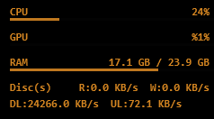

# HalfLife Monitoring

<p align="center">
  
</p>

<p align="center">
  <strong>Sistema de monitoramento de hardware para Windows com overlay Rainmeter</strong>
</p>

<p align="center">
  <a href="README.md">English</a> •
  <a href="#recursos">Recursos</a> •
  <a href="#instalação">Instalação</a> •
  <a href="#uso">Uso</a>
</p>

---

## Recursos

- **CPU**: Uso % + Temperatura °C
- **GPU**: Uso % + Temperatura °C *(NVIDIA/AMD/Intel)*
- **RAM**: Uso em GB
- **Disco**: Leitura/Escrita em MB/s
- **Rede**: Download/Upload em MB/s

### Principais Benefícios

- **Monitoramento real de GPU** - Usa LibreHardwareMonitorLib para leituras precisas
- **Leve** - Uso mínimo de recursos (~10MB RAM)
- **Personalizável** - Edite cores, posição e métricas facilmente
- **Início automático** - Executa na inicialização do Windows
- **Código Aberto** - Licença MIT

---

## Requisitos

- **Windows 10/11** (x64)
- **Rainmeter 4.5+** - [Baixar](https://www.rainmeter.net/)
- **.NET 8.0 Runtime** - [Baixar](https://dotnet.microsoft.com/download/dotnet/8.0)

---

## Instalação

### Instalação Rápida (Recomendado)

1. **Baixe** o último release: [HalfLifeMonitoring-Release.zip](../../releases/latest)
2. **Extraia** o arquivo ZIP
3. **Execute** `setup.bat` como Administrador
4. **Pronto!** O overlay aparecerá no canto superior direito

### Instalação Manual

<details>
<summary>Clique para expandir os passos de instalação manual</summary>

#### 1. Instalar Skin do Rainmeter

- Dê duplo clique em `HalfLifeMonitoring.rmskin`
- Siga as instruções do instalador do Rainmeter

#### 2. Instalar TempBridge

- Copie a pasta `TempBridge` para `C:\Program Files\HalfLifeMonitoring\`
- Execute `install.bat` para adicionar à Inicialização do Windows
- Inicie `TempBridge.exe`

#### 3. Carregar a Skin

- Abra o Rainmeter
- Encontre "HalfLifeMonitoring" na lista de skins
- Clique em "Load"

</details>

---

## Uso

### Primeira Execução

Após a instalação, você deve ver:
- TempBridge rodando (janela do console ou ícone na bandeja)
- Overlay do Rainmeter no canto superior direito
- Todas as métricas atualizando em tempo real

### Personalização

Edite `HalfLifeMonitoring.ini` para personalizar:

```ini
[Variables]
; Mudar cores (R,G,B,Alfa)
textColor=0,255,255,190
barColor=0,255,255,160

; Mudar posição
WindowX=(#SCREENAREAWIDTH# - #width# - 20)
WindowY=40
```

### Solução de Problemas

**GPU mostra 0%?**
- Certifique-se que TempBridge está rodando
- Verifique se `@Resources/hwstats.txt` existe e está sendo atualizado
- Tente reiniciar o TempBridge

**Disco sempre 0 MB/s?**
- Execute `fix_disk_monitoring.bat` como Administrador
- Reinicie seu computador

**Skin não carrega?**
- Atualize o Rainmeter (clique direito → Refresh All)
- Verifique os logs do Rainmeter para erros

---

## Compilando do Código Fonte

### Pré-requisitos

- .NET 8.0 SDK
- Visual Studio 2022 ou VS Code (opcional)

### Passos de Compilação

```bash
# Clone o repositório
git clone https://github.com/seuusuario/halflife-monitoring.git
cd halflife-monitoring

# Compile o TempBridge
cd TempBridge
dotnet restore
dotnet build -c Release

# Crie o pacote de release
cd ../scripts
build-release.bat
```

A saída estará na pasta `dist/`.

---

## Estrutura do Projeto

```
halflife-monitoring/
├── TempBridge/              # Serviço C# em segundo plano
│   ├── Program.cs           # Lógica principal de leitura de sensores
│   ├── TempBridge.csproj    # Arquivo de projeto
│   └── install.bat          # Instalador de inicialização
├── HalfLifeMonitoring.ini   # Skin do Rainmeter
├── @Resources/              # Recursos da skin
│   └── hwstats.txt          # Dados dos sensores (gerado)
├── scripts/                 # Automação de build
│   └── build-release.bat
├── installer/               # Distribuição
│   └── setup.bat
└── README.pt-BR.md
```

---

## Contribuindo

Contribuições são bem-vindas! Por favor:

1. Faça um Fork do repositório
2. Crie uma branch de feature (`git checkout -b feature/funcionalidade-incrivel`)
3. Commit suas mudanças (`git commit -m 'Adiciona funcionalidade incrível'`)
4. Push para a branch (`git push origin feature/funcionalidade-incrivel`)
5. Abra um Pull Request

---

## Licença

Este projeto está licenciado sob a **Licença MIT** - veja o arquivo [LICENSE](LICENSE) para detalhes.

---

## Agradecimentos

- [LibreHardwareMonitorLib](https://github.com/LibreHardwareMonitor/LibreHardwareMonitor) - Biblioteca de monitoramento de hardware
- [Rainmeter](https://www.rainmeter.net/) - Plataforma de customização de desktop

---

## Suporte

- **Issues**: [GitHub Issues](../../issues)
- **Discussões**: [GitHub Discussions](../../discussions)

---

<p align="center">Feito por <a href="https://github.com/seuusuario">Kaic</a></p>
